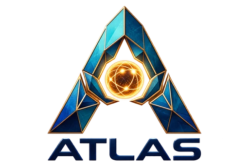

# ATLAS



ATLAS is a wearable AI museum guide built by Team Touchdown at College
Bourget for WRO 2026 Future Innovators. It combines artwork recognition,
conversational guidance, visitor preferences, and a museum control dashboard
to make an exhibit easier to explore without replacing the museum staff or the
artwork itself.

Public project website:
https://emersonv32.github.io/ATLAS_School_Pilot_v1_Phase3_1/

## What makes ATLAS different

- **Eyes on the artwork:** a wearable camera can identify or manually capture
  the work in front of the visitor.
- **A continuing conversation:** ATLAS keeps short-term context so follow-up
  questions can refer to the current artist or artwork without carrying stale
  subjects through the entire visit.
- **Museum knowledge plus general intelligence:** curated content is preferred
  when it is relevant, while Gemini can answer broader questions when the
  museum retrieval layer has no useful match.
- **A visit shaped to the person:** the visitor setup covers language,
  familiarity, interests, accessibility preferences, and headset readiness.
- **A recoverable prototype:** runtime source, content sources, setup guidance,
  tests, and recovery checks are versioned together.

## Repository map

| Path | Purpose |
| --- | --- |
| [`atlas/`](atlas/) | Current ATLAS runtime, tests, configuration, content sources, firmware, and deployment scripts. This is the only active implementation. |
| [`handoff/`](handoff/) | Current manuals, architecture, privacy notes, troubleshooting, validation steps, and continuity instructions for another developer, LLM, or Jetson. |
| [`comp_info/`](comp_info/) | WRO 2026 competition binder with official rules, deadlines, travel and customs guidance, packing, booth, judging, and recovery checklists. |
| [`archive/`](archive/) | Date-organized historical snapshots, reports, one-time patches, and superseded utilities. Nothing here is part of the active runtime. |

Start a technical continuation with
[`handoff/START_HERE.md`](handoff/START_HERE.md). Start a Jetson rebuild with
[`handoff/jetson/REBUILD_FROM_FRESH_FLASH.md`](handoff/jetson/REBUILD_FROM_FRESH_FLASH.md).

## Current prototype

The current codebase includes:

- camera and manual artwork capture;
- retrieval-augmented museum content with Gemini fallback;
- short-term conversational context;
- Deepgram speech recognition and Cartesia speech synthesis integrations;
- visitor and staff dashboards;
- 20 staff-selectable spoken languages in the admin demo controls, while the
  visitor onboarding retains its smaller validated public-language list;
- English, French, Spanish, Italian, Arabic, and Traditional Chinese visitor
  interface resources;
- headset button integration, readiness checks, session controls, and local
  event storage;
- mock providers and automated tests for laptop development without Jetson
  hardware.

ATLAS is edge-oriented, but the current prototype is not fully offline: its
configured speech and language services can send audio or text to cloud
providers. See [`handoff/policies/`](handoff/policies/) for the disclosure and
privacy model.

## Run locally

Python 3.10 or newer is recommended.

```bash
cd atlas
python -m venv .venv
```

Activate the environment, then install and verify the project:

```bash
python -m pip install -e ".[dev]"
python -m pytest -q
python scripts/verify_recovery_bundle.py
```

Run the dashboard with mock integrations:

```bash
python -m uvicorn atlas.dashboard.api:app --host 127.0.0.1 --port 8765
```

The visitor setup is served at `http://127.0.0.1:8765/` and the museum staff
dashboard at `http://127.0.0.1:8765/admin` by default.

## Project documentation

- [WRO 2026 competition information hub](comp_info/README.md)
- [System architecture](handoff/architecture/SYSTEM_ARCHITECTURE.md)
- [Developer guide](handoff/DEVELOPER_GUIDE.md)
- [Content pack format](handoff/CONTENT_PACK_FORMAT.md)
- [Operations and demo guides](handoff/operations/)
- [Troubleshooting](handoff/TROUBLESHOOTING.md)
- [Recovery and Jetson manuals](handoff/jetson/)
- [Historical archive index](archive/README.md)

## Status

ATLAS is an actively developed student prototype. Automated laptop validation
is included in the repository; camera, audio, headset, CUDA/TensorRT, and
systemd behavior must also be checked on the target Jetson after deployment.

The old repository for ATLAS is at: https://github.com/alexwithadog/wrofutureinnovators2026 
